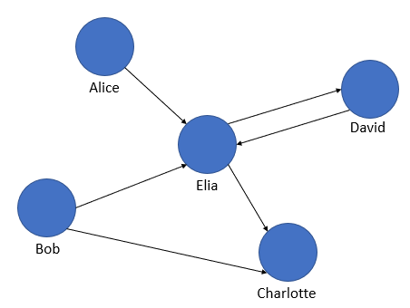

# GCalc - Graph Calculator
Technion Introduction to System Programming (234124) final project.  
Grade: 95.

<p align="center">
  
</p>

## Contents
 - [About The Project](#about-the-project)
 - [Usage](#usage)
    - [Defining a new variable](#defining-a-new-variable)
    - [Assigning the result of an expression into another variable](#assigning-the-result-of-an-expression-into-another-variable)
    - [Runing one of the commands supported by the calculator](#runing-one-of-the-commands-supported-by-the-calculator)
    - [Notice](#notice)
 - [Graph Syntax](#graph-syntax)
 - [Expressions and Operators](#expressions-and-operators)
    - [Union](#union)
    - [Intersection](#intersection)
    - [Difference](#difference)
    - [Product](#product)
    - [Complement](#complement)
    - [Notice](#notice-1)
 - [Calculator Commands](#calculator-commands)
    - [print(G)](#printg)
    - [delete(G)](#deleteg)
    - [save(G, filename)](#saveg-filename)
    - [G=load(filename)](#gloadfilename)
    - [who](#who)
    - [reset](#reset)
    - [quit](#quit)
    - [Notice](#notice-2)
 - [Batch Mode](#batch-mode)
 - [Execute Example](#execute-example)
 - [Python Interface](#python-interface)
    - [create()](#create)
    - [destroy(graph)](#destroygraph)
    - [addVertex(graph, v)](#addvertexgraph-v)
    - [addEdge(graph, v1, v2)](#addedgegraph-v1-v2)
    - [disp(graph)](#dispgraph)
    - [graphUnion(graph_in1, graph_in2, graph_out)](#graphuniongraph_in1-graph_in2-graph_out)
    - [graphIntersection(graph_in1, graph_in2, graph_out)](#graphintersectiongraph_in1-graph_in2-graph_out)
    - [graphDifference(graph_in1, graph_in2, graph_out)](#graphdifferencegraph_in1-graph_in2-graph_out)
    - [graphProduct(graph_in1, graph_in2, graph_out)](#graphproductgraph_in1-graph_in2-graph_out)
    - [graphComplement(graph_in, graph_out)](#graphcomplementgraph_in-graph_out)
 - [Python Execute Example](#python-execute-example)
 - [Make](#make)
    - [Compile](#compile)
    - [Create The Library File](#create-the-library-file)
 - [License](#license)

## About The Project
Graph (discrete mathematics) is a structure amounting to a set of objects in which some pairs of the object are in some sense "related". ([Wikipedia](https://en.wikipedia.org/wiki/Graph_(discrete_mathematics)))  
Each object represents an element, for example a city, a person, a computer server.  
A graph describes the relationship between the elements, for example a network of users in a social network.  
The people are represented through the vertices and the connections between them through edges.  
<p align="center">
  
</p>
This program is a shell graph calcutalor, which lets you unite, intersect, substract, cross and find the complement of a graph.
"Gcalc>" tag will be prompted in the shell.

## Usage
### Defining a new variable
First you declere the graph name, than you use the graph syntax to describe the graph:  
```Gcalc> G1={a,b | <a,b>}```  

You can also assign an existing graph to a new variable:  
```Gcalc> G2=G1 ```

### Assigning the result of an expression into another variable  
```Gcalc> G1 = !G0```  
```Gcalc> G3 = {a,b | <a,b>} + G2```  

### Runing one of the commands supported by the calculator
```Gcalc> print(myGraph)```

#### Notice
* Graph name can only contain alphanumeric characters.
* Variables, vertices, edges and function names are case-sensitive.
* Spaces can separate elements of a phrase or command, but not allowed within names. For example, ```myGraph    = G1+  G2``` allowed, but ```G 1 = !G2``` not.
* If the expression on the right side of the assignment contains an error, then the variable value on the left does not change.
* A graph name that appears for the first time on the right side of a phrase (or as an argument of a command) without being previously defined carries an error.

## Graph Syntax
The characters that can appear in a vertex name are: English (lowercase and uppercase) letters, and the characters '\]', '\[', and '\;'.  
If square brackets appear in the name of a vertex, they must be balanced, that is, for each opening bracket '\[' must have a closing bracket '\]' suitable after it, and vice versa, for each closing bracket '\]' there must be an opening bracket '\[' in front of him.  

A directed edge is described by an orderly pair of vertices, separated by a comma and surrounded by '<' and '>'. For example, the edge <x2, x1> goes from vertex x2 to vertex x1.

Graph G defined as: {v1, v2, ... , vn | e1, e2, ... , em}. List of n vertices, followed by a list of m edges.

## Expressions and Operators
### Union
Unite two graphs unites both the vertices and the edges of the two graphs.  
```G1 = G2 + G3```  
```gr = G1 + {a,b|<a,b>}```
### Intersection
Intersection between two graphs intersect both the vertices and the edges of the two graphs.  
```G1 = myGraph ^ gr```  
```G2 = {a,b,c,d | <b,d> , <a,d>} ^ gr```
### Difference
The difference between two graphs G1 and G2 contains all the vertices in graph G1 that are not in graph G2, and all the edges from graph G1 if both end vertices of this edge exist in the result graph.  
```diff = {a,b | <a,b>} - {a,c | <c,a>}```  
```diff = G1 - {a,c | <c,a>}```
### Product
The vertices and edges in the graph of the product are obtained from pairs of vertices / edges from graphs G1 and G2.
For every possible pair of vertex v from G1 and vertex w from G2, a vertex named \[w; v\] in be in the result graph.  
Also, for every possible pair of edges \<v2, v1\> from G1, and \<w2, w1\> from G2, there will be an edge from the vertex \[w1; v1\] to the vertex \[w2; v2] in the the product graph.  
```prod = {a,b | <a,b>} * {a,c | <c,a>}```  
```G2 = G1 * {a,c | <c,a>}```  
```G3 = G1 * prod```
### Complement
Complement of a graph is a graph in which the set of vertices is the same as that of the original graph, while the set of edges contains all possible edges that were not in the original graph.  
```G1 = !G2```  
```G3 = !{a,b,c | <a,b>}```
#### Notice
* The expression can contain a sequence of several operators, and the expression evaluated from left to right. ```G1 = G2 + G3 - G4```
* The expression can contain graph names and graph literals. ```G2 = G1 + {a,b|<a,b>}```
* You can use parentheses to change the evaluation order of a sequence of operators. ```G4 = G3 + (G2*G2)```

## Calculator Commands
### print(G)
Print the content of the graph.
```
Gcalc> myGraph={x, y, z | <x,y>, <y,z>, <z,x>}
Gcalc> print(myGraph)
x
y
z
$
x y
y z
z x
```  
A graph literal, or exppression can be used insted of graph name.
### delete(G)
Delete the graph named "G".
### save(G, filename)
Save the graph G to a file named "filename". Recommended extension: .gc  
A graph literal, or exppression can be used insted of graph name.
### G=load(filename)
Load graph from file named "filename" into variable named G. Can be used inside an exppression, in this case no need to assign the load result.
### who
Displays a list of all variables (graphs) defined.
```
Gcalc> who
G1
G2
```
### reset
Delete all the existing graphs.
### quit
Quit the graph calculator.

#### Notice
Function names are reserved words, they cannot be used as names of variables (graphs).

## Batch Mode
The program runs in automatic mode when run from the command line with two arguments, an input file and an output file.  
For example: ```gcalc input.txt output.txt```.  

## Execute Example
```
Gcalc> G1={x1,x2,x3,x4|<x4,x1>, <x3,x4>,<x2,x3>,<x1,x2>}
Gcalc> G2 = { x1,y1 | <x1,y1> }
Gcalc> H = G1 + G2
Gcalc> print(H)
x1
x2
x3
x4
y1
$
x1 x2
x1 y1
x2 x3
x3 x4
x4 x1
Gcalc> who
G1
G2
H
Gcalc> reset
Gcalc> print(H)
Error: Undefined variable 'H'
Gcalc> G1 {x,y|<y,x>}
Error: Unrecognized command 'G1 {x,y|<y,x>}'
Gcalc> quit
```

## Python Interface
The program can be used in python, by including the library to your code.
### create()
Return pointer to new graph.
### destroy(graph)
Free the graph passed as a parameter.
### addVertex(graph, v)
Add the vertex v (given as a string) to the graph.  
The function returns the graph.
### addEdge(graph, v1, v2)
Add the edge <v1, v2> to the graph.  
The function returns the graph.
### disp(graph)
Print the graph to stdout.
### graphUnion(graph_in1, graph_in2, graph_out)
Unite two graphs.  
graph_out must be a pointer to a pre-existing graph, and it will be overwriten.
### graphIntersection(graph_in1, graph_in2, graph_out)
Intersect two graphs.  
graph_out must be a pointer to a pre-existing graph, and it will be overwriten.
### graphDifference(graph_in1, graph_in2, graph_out)
Substract two graphs.  
graph_out must be a pointer to a pre-existing graph, and it will be overwriten.
### graphProduct(graph_in1, graph_in2, graph_out)
Cross two graphs.  
graph_out must be a pointer to a pre-existing graph, and it will be overwriten.
### graphComplement(graph_in, graph_out)
Get the complement of a graph.  
graph_out must be a pointer to a pre-existing graph, and it will be overwriten.

## Python Execute Example
```Python
>>> import graph as gw
>>> g1 = gw.create()
>>> gw.disp(g1)
$
>>> g1 = gw.addVertex(g1, 'a')
>>> g1 = gw.addVertex(g1, 'b')
>>> gw.disp(gw.addEdge(g1, 'a', 'b'))
a
b
$
a b
>>> gw.addEdge(g1, 'a', 'c')
Error: Cannot add edge <a,c> due to missing endpoint.
>>> g2 = gw.create()
>>> g2 = gw.addVertex(g2, 'c')
>>> gw.disp(gw.graphUnion(g1, g2, g1))
a
b
c
$
a b
>>> gw.disp(g1)
a
b
c
$
a b
>>> gw.destroy(g2)
>>> gw.destroy(g1)
```

## Make
### Compile
Just use ```make``` in your project directory.
### Create The Library File
Use ```make libgraph.a``` to create the lib file.  
Than, use ```swig -python -o graph_wrap.c graph.i``` to create the python interface.   
Lastly, use ```g++ -std=c++11 -DNDEBUG --pedantic-errors -Wall -Werror -I/usr/local/include/python3.6m -fPIC -shared graph_wrap.c libgraph.a -o _graph.so``` to create the python library file.

## License
The Unlicense.  
How many hours did you spend reading the license of libraries you wanted to use?  
How many times have you given up on contributing to an open source project just because its license did not suit your taste for open source?  
The code of my project is dedicated to the public domain, for free use in any form you choose.  
For more details, please read the license file.
